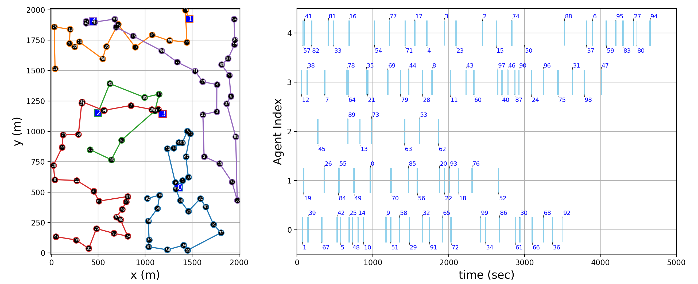

# TAS-AMP
Solving Task Assignment and Scheduling problem (TAS) with Approximate Message Passing (AMP) algorithm

Code for TAS-AMP

* Preparataion
   Simply execute the command below in your terminal to finish setting up the imports.
   ```
   pip install gurobipy lkh numpy matplotlib
   ```

   1) Gurobi 
      - gurobi license is necessary
      - pip install gurobipy
   
   2) LKH
      - pip install lkh
      - and LKH solver should be installed
   
   - Ubuntu or Mac
   ```
   wget http://akira.ruc.dk/~keld/research/LKH-3/LKH-3.0.6.tgz
   tar xvfz LKH-3.0.6.tgz
   cd LKH-3.0.6
   make
   sudo cp LKH /usr/local/bin
   ```
   
   
   - Window
       - Download exe file (http://webhotel4.ruc.dk/~keld/research/LKH-3/LKH-3.exe) 
   
   
   - Example code for LKH
   ```
   import requests
   import lkh
   
   problem_str = requests.get('http://vrp.atd-lab.inf.puc-rio.br/media/com_vrp/instances/A/A-n32-k5.vrp').text
   problem = lkh.LKHProblem.parse(problem_str)
   
   solver_path = '../LKH-3.0.6/LKH'
   lkh.solve(solver_path, problem=problem, max_trials=10000, runs=10)
   ```
   
   - You can modify the solver path to match your computer settings.


* Example result
  The following is a graph illustrating the task assignment results
  
